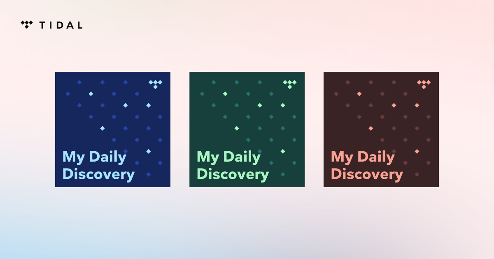
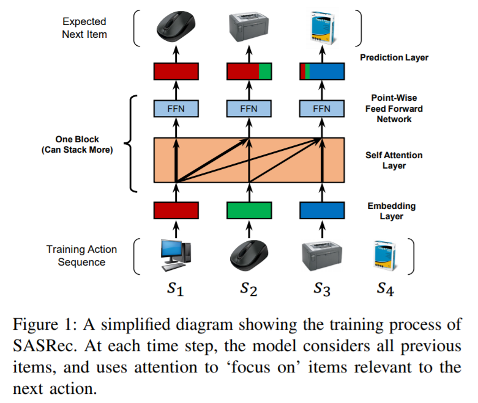
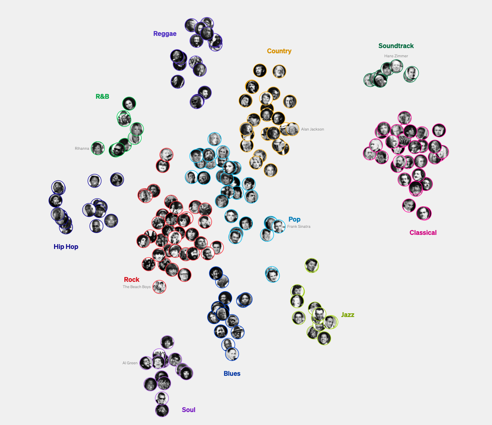

# Daily discovery

## Intro

At Tidal, our goal is to help the user find the best track, album, playlist or mix for any moment for any occasion, and we heavily utilize machine learning, especially recommender systems, to achieve this goal.

Machine learning is well renowned for capturing patterns, and exploiting that knowledge, in recommender systems, these patterns can be formulated as a given user's affinity to a certain item, a very famous example in almost every streaming and ecommerce platform is "because you checked this item" and you get a list of similar items.

Different companies utilize a plethora of different techniques to capture such patterns, with some of the most famous examples being collaborative filtering through matrix factorization and factorization machines, more advanced deep learning algorithms, and lately transformer based sequence models.

However no matter the technique, they all fundamentally capture already existing patterns, and more often than not, in the music domain, the user will already be familiar with the recommended tracks coming from exploiting these patterns.

This all well and good for lean back autoplay situations, but for music discovery, it can be a bit challenging, in this blog post we discuss how Tidal creates it's daily discovery, how do we get around the fundamental limitations of machine learning to create a mix of songs that are relevant, yet never interacted before by the user on our platform.

## What is my daily discovery

My daily discovery is a daily updated mix of 10 songs that are:

1. Highly relevant to the user
2. The user has not streamed before on Tidal.
3. From a diverse set of artists, some are known to the user, some are new.

### Why daily

We want to give our users something new and interesting every day, where you can find something new on your commute, workout or actively checking the new daily mix, and you can come back tomorrow for a new daily dose of new music

### Why 10

We found out that the median duration of the songs that we recommend is more or less around the 3 minutes mark, so 10 tracks would make the perfect 30 minutes mark of a consumable new music session for our users.

### What is a "diverse set of artists"

We want the discovery mix to be eclectic, we believe with a diverse set of artists, the users can get exposed to new songs, genres and music scenes that they will fall in love with.

We define diversity on different levels, including whether the user is already familiar with the artist, the main genres of the artist, and the active years of the artist.

## How it works

Now we'll talk about all the magic behind the scenes, how we create our daily discovery, what is the problem formulation, how we utilize machine learning to get new music, what models are used, and how the final result is wrapped up and served to the user.

### The tech stack empowering daily discovery

The daily discovery problem requires us to process a huge amount of data, train some models, and serve our recommendations. Here are the main technologies that we use.

#### Spark for data processing

[Apache spark](https://spark.apache.org/) is an open source distributed computing system that utilizes clusters (compute nodes) to provide in memory data processing for large datasets,

We utilize the [Pyspark](https://spark.apache.org/docs/latest/api/python/index.html) flavor as our team of machine learning engineers are well versed in python.

Our main compute provider for running spark jobs and streams is [databricks](https://www.databricks.com/), the company founded by the creator of the spark tool.

#### Modeling

We utilize multiple platforms and technologies for training our machine learning models.

##### MLlib from spark for clustering

[MLlib](https://spark.apache.org/docs/latest/ml-guide.html) (Machine Learning Library) is an apache spark library for machine learning. We utilize MLlib for distributed clustering with classical approaches like [Kmeans](https://spark.apache.org/docs/latest/mllib-clustering.html#k-means).

##### AWS Blazing text for Word2Vec

[Blazing text](https://docs.aws.amazon.com/sagemaker/latest/dg/blazingtext.html) from AWS is an efficient serveless word2Vec model trainer, We simply provide it with the training data and model hyperparameters, and it creates the embeddings for our "words" more on that in the artifact embedding section.

##### Pytorch lightning for deep learning

[Lightning](https://lightning.ai/), a lightweight PyTorch wrapper that simplifies the training process, is our deep learning framework of choice. It's easily extendable while offering great features including using different types of hardware acceleration like GPU for model training effortlessly.

#### MLFlow for Logging

[MLFlow, an open](https://mlflow.org/) source machine learning lifecycle platform, is our go to tool for logging, we use it to log and comprate experiments metrics, hyperparameters as well as artifacts like saving the model binary executable.

#### Airflow for orchestrating

We utilize [Apache Airflow](https://airflow.apache.org/), an open source tool for orchestrating and scheduling workflows, as our main scheduler, we use airflow providers and operators to essentially call different APIs to run our jobs, contrary to some other users, we don't run any production code on airflow, rather API calls to different providers like AWS and Databricks that then runs dockerized jobs for different purposes.

#### Spark for inference

GPU instances, especially ones containing [Nvidia tesla v100](https://www.nvidia.com/en-gb/data-center/tesla-v100/) are very expensive, we only use these instances and clusters to train the models, however we save the binary executable models to MLflow, and then using spark we run the inference steps from our Models on multiple smaller and cheaper GPU instances.

#### DynamoDB for online serving

In order to serve our mixes to the users, we need to store those mixes for all users in a high performance database. As the use case is a simple list of mixes metadata for each user, we decided to go with a simple key value NoSSQL database, aws [DynamoDB](https://aws.amazon.com/dynamodb/) was the perfect tool to serve our mixes, as it serverless, reducing any maintenance costs, and scales horizontally, making it very versatile handling varying workloads and large datasets.

#### Microservice

Last but not least, the last part of the stack would be the backend code itself, querying DynamoDB using AWS SDK, and exposing users' mixes through API endpoints. For the daily discovery use case, we utilize a [Java spring boot](https://spring.io/projects/spring-boot) microservice, hosted on AWS [ECS](https://aws.amazon.com/ecs/).

### Machine learning work

#### Problem formulation

Given a sequence of track IDs from a user, find the next song that is unknown but likely to be preferred by that user, this is also known as the next token prediction problem.

#### Training data

For each user, their training data consists of all the tracks they have favourited, all the tracks they have in a playlist, as well as all tracks that the user has fully streamed at least twice before.

The sequences are then filtered according to a set of parameters that were set during data centric offline experiments that include:

1. Maximum number of tracks per user.
2. Maximum number of an item being in a sequence.
3. Minimum number of tracks for a sequence to be accepted.

These sequences, each represent a user are then split into training, testing, and inference dataset, where

1. Training dataset will be used to train the sequence model, as well as validating this model performance.
2. Test dataset is used to score the model to track its performance and any kind of drift.
3. Inference, a superset of training and dataset, will be used for predicting the next sequence of items that the user will stream.

#### Sequence model

##### Creating sequences

To get the user's most likely song to be streamed next, we first need a sequence to get a sequence that represents that user, we do this be getting all the user's previous interactions of tracks, which includes listening, favourting, and adding to a playlist, we then score each track based on the number and the type of interaction, for example we give a higher score to favourting a track since it's an explicit signal instead of an implicit one, we then rank these tracks according to their score, the higher the score, the earlier in the sequence the track is placed, lastly we limit the number of interactions to 500

##### Training

The sequence model used in this sequence problem is SASRec, or Self-Attentive Sequential Recommendation by Wang-Cheng Kang, Julian McAuley from UC San Diego [https://arxiv.org/pdf/1808.09781.pdf](https://arxiv.org/pdf/1808.09781.pdf)

In our current problem formulation, each user has a sequence of track IDs, we then try to predict the next track given the sequence of all previous tracks.
For training just like the original paper, we use binary cross entropy loss.

##### Prediction

After training the model, we take up to the aforementioned 500 tracks and we infer the probability of the next song from our vocabulary. We limit the number of candidates to 6000 songs with the highest probability of streaming.

The reason behind such a high number of 6000 recommendations, is that the majority of the tracks predicted are highly likely to be streamed by the user before, and they do not fulfill the discovery objective of the daily discovery mix, and as for the limit of 500 tracks, this was tuned as a data centric experiment that gave the highest performing model, the main performance gauge for this problem is ndcg@k.

#### Clustering model

##### Artist embedding

"You shall know a word by the company it keeps," by linguist and philosopher J.R. Firth

Word2vec model, [https://arxiv.org/pdf/1301.3781.pdf](https://arxiv.org/pdf/1301.3781.pdf), is a famous NLP technique developed by google, it represents words by a high dimensional vectors based on their contextual usage, aka what other words co-appear together.

Word2Vec is very relevant in recommender systems, for example, Facebook suggests using word2vec to recommend movies to users based on their past streaming history in their [StarSpace](https://github.com/facebookresearch/StarSpace#pagespace-user--page-embeddings) implementation of [embed all things paper](https://arxiv.org/abs/1709.03856).

Our Approach is very similar, as we have millions and millions of manually curated playlists that our users craft and spend a lot of time and effort perfecting, we can then handle each playlist as a sentence, and each track or artist performing that track as a word, and from there we can create a high dimensional vector representation of the tracks or artists.

Needless to say, there is a lot of optimization involved to make the word2vec model work in the music domain, but the main idea stays the same, "You shall know an artist by accompanying other artists in the playlists".

For the technology we use to create these artists embeddings, we utilize the aforementioned AWS blazing text.

##### Clustering

In order to get a grasp of how the artist's embedding can be useful, we can use some dimensionality reduction technique like Principle component analysis ([PCA](https://en.wikipedia.org/wiki/Principal_component_analysis)) to condense those vectors into 2 two dimensions, then we can plot how different artists relate to each other.

Below is a visualization done By Open AI's Jukebox, and even though it utilizes the track audio to create the embeddings, this can give us a grasp of what the artist embedding model produces.

Open AI's [JukeBox](https://openai.com/research/jukebox) artists embedding visualization

Based on the artists embeddings, we can create simple clusters using k-means, like the distributed version provided by spark's MLlib, or other advanced clustering algorithms, the end goal is to group similar artists together, similarity is very correlated to genre and era, but it is defined from our users taste of grouping different artists and tracks in their playlist.

### Post processing

For each user, represented by a sequence of tracks, our SASRec model provides us a list of 6000 songs that have the highest probability of being streamed next. However these tracks are not ready to be served to the user, and need a set of post processing steps to give the required discovery experience.

1. First we need to remove all tracks that the user has interacted with before, as the user is already familiar with those tracks.
2. Next we limit the number of known artists by 20%. We believe there's a lot of value in discovering new artists, as it is much easier to discover tracks by artists already known to the user, and the daily discovery can be a good tool to expose you to new artists.
3. We then diversify our recommendations using the aforementioned clustering model, limiting the number of artists per cluster, this will create a diverse set of tracks of different scenes to expose the user to.
4. Lastly we try to make these mixes consistent day to day, making sure that we spread known artists and artists from the same cluster across the days of the week, so each day our users get an engaging and diverse set of music to discover daily.

After the suggestions have been processed, they are divided into daily mixes and stored on AWS S3.

Both the inference and the training pipelines run weekly for all users, and daily pipeline is run for new users who just joined Tidal.

### Serving

As mentioned the techstack section, we store our daily discovery mixes in AWS DynamoDB due to its favorable scaling characteristics

## Open sourced code

The goal of this blog post is to give an overview of how Tidal creates its personalized daily discovery mix, and how it utilizes machine learning and big data technology to achieve this goal.

To give the development community a better understanding of the exact steps, techniques, and technologies we used, We're sharing our source code, **that is currently actively maintained and used in our production pipelines**, to create the daily discovery mix.

### Daily discovery mix

[https://github.com/tidal-music/tidal-algorithmic-mixes](https://github.com/tidal-music/tidal-algorithmic-mixes), [https://pypi.org/project/tidal-algorithmic-mixes](https://pypi.org/project/tidal-algorithmic-mixes)

We're open sourcing four Pyspark pipelines used for create the discovery mix pipeline:

1. Daily update: a simple pipeline that subsets the current daily suggestions to a daily mix of 10 songs.
2. Observed tracks aggregator: A simple pipeline that stores all daily discovery tracks that have been observed by the user, i.e the user checked the discovery mix page.
3. Post processing: the source code for the post processing step described above.
4. SASRec transformation: A pipeline that utilizes a compiled SASRec model to predict the top 200 songs for each user that they are most likely to stream next.

### Utility transformers

[https://github.com/tidal-music/per-transformers](https://github.com/tidal-music/per-transformers), [https://pypi.org/project/tidal-per-transformers](https://pypi.org/project/tidal-per-transformers)

We're also open sourcing all of our utility transformers, our logic abstraction unit in PySpark to do a single step of data transformation, these transformers are used heavily on all of our batch and streaming jobs, like the ones in the Daily discovery use case.

### Future work

This is just the first of many steps Tidal is taking to be more transparent and to help the development and research communities our next steps include:

1. Open source the machine learning data processing pipeline used to create the sequences used to train the SASRec algorithm.
2. Open source our SASRec implementation and training pipeline.
3. Open source other mixes like Track radios and my mixes, and algorithms like the aforementioned clustering and embeddings models.
